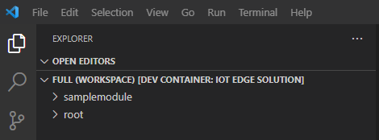
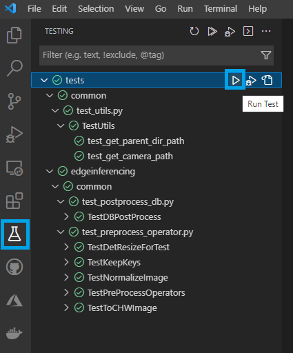
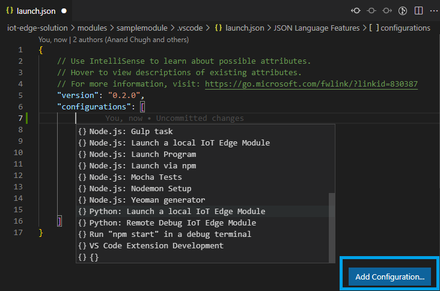
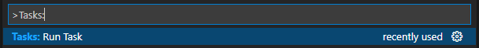
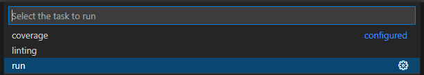
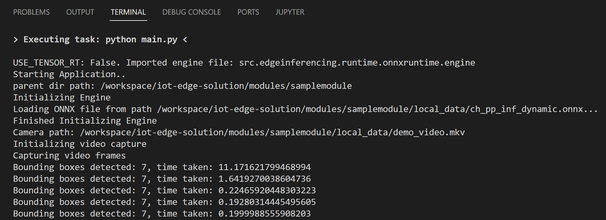
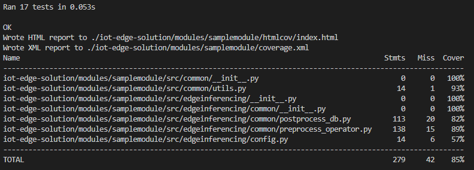

# Inner Loop for Azure IoT Edge Vision AI Solutions on NVIDIA Jetson Devices

This sample provides an inner loop setup to build an Azure IoT Edge solution for vision on the edge use case for devices powered by NVIDIA GPUs such as [NVIDIA Jetson](https://developer.NVIDIA.com/embedded/jetson-modules).

## Contents

| File/folder | Description |
|-------------|-------------|
| `getting-started` | Hardware specific guidelines to setup inner loop environment. |
| `.devcontainer` | Development container configuration files. |
| `iot-edge-solution` | Sample Azure IoT Edge solution. |
| `.env_template` | Template for environment variables file. |
| `.gitignore` | Define what to ignore at commit time. |
| `CHANGELOG.md` | List of changes to the sample. |
| `CONTRIBUTING.md` | Guidelines for contributing to the sample. |
| `LICENSE`   | The license for the sample. |

## Problem Summary

This sample seeks to address the following problems that can arise while developing edge solutions:

1. **Dependency on edge hardware**  
   When building a Vision AI solution for edge, dependency on the edge hardware for development can become a blocker. All developers in the team may not have access to an edge device and hence, they are unable to code, debug and run the solution.
1. **Dependency on peripheral devices**  
   Dependency on peripheral devices such as a video camera for developing a Vision AI solution can become a blocker. Moreover, when developing inside a container on Windows or Mac, it might be tricky to access a camera device as the path `/dev/video0` is not supported.
1. **Test and debug multiple edge modules**  
    A complete IoT Edge solution could have multiple edge modules each requiring their own configurations for testing and debugging. It would be cumbersome for a developer to switch between different edge modules and load the appropriate configurations for testing and debugging during the development process.

## Solution Summary

This sample inner loop setup helps decouple hardware dependency from the development process, thereby enabling developers who do not have access to edge hardware such as NVIDIA Jetson to still code, debug and run Azure IoT Edge Vision AI solutions on any of the below mentioned hardware platforms:

- ARM64-based-devices without NVIDIA graphics card such as Macbook Pro with M1 chip
- AMD64-based-devices with NVIDIA graphics card
- AMD64-based-devices without NVIDIA graphics card

 > [Github Codespaces](https://github.com/features/codespaces) is also supported as a development platform.

It also allows developers who have AMD64-based-laptops with NVIDIA graphics card to leverage [CUDA](https://developer.NVIDIA.com/cuda-zone) to accelerate Machine Learning inference.

With this inner loop setup, developers who do not have access to peripheral devices such as video camera or are unable to access a camera device inside the dev container on a Windows or Mac laptop can configure the Vision AI solution to use a [local video file](iot-edge-solution\modules\samplemodule\local_data\demo_video.mkv) to test and debug. This setup also allows developers with a Linux machine to load and access a camera device from within the dev container in the path `/dev/video0`.

This inner loop setup uses a VS Code multi-root workspace where each edge module is represented as a separate folder with it's own test configuration settings in `settings.json` and debugger launch configurations in `launch.json`. This enables a developer to seamlessly test and debug different edge modules in one place.

## Solution Components

### Development Container

This sample uses [Visual Studio Code devcontainer](https://code.visualstudio.com/learn/develop-cloud/containers) to code, debug and run a vision on edge solution on different hardwares with different processor architectures. It uses a Dockerfile with [multi-stage builds](https://docs.docker.com/develop/develop-images/multistage-build/), where each build stage is specific to a hardware and architecture. The final image is built based on the processor architecture and whether the hardware is supported by NVIDIA GPUs.

> `FROM base-${TARGETARCH}-${CUDA_SUPPORT} AS base`

[Docker BuildKit](https://docs.docker.com/develop/develop-images/build_enhancements/) is enabled to build an efficient Docker image where build stages that are not required for the hardware in use are skipped.

The different build stages used are as follows:

- base-amd64-nocuda  
  This build stage is used to build devcontainer base image for AMD64-based-devices without NVIDIA graphics card. Here [ONNX Runtime](https://onnxruntime.ai/) is used to perform model inference.
- base-amd64-cuda  
  This build stage is used to build devcontainer base image for AMD64-based-devices with NVIDIA graphics card. Here [TensorRT](https://developer.NVIDIA.com/tensorrt#:~:text=TensorRT%2C%20built%20on%20the%20NVIDIA,high%20performance%20computing%2C%20and%20graphics.), which is built on NVIDIA CUDA is used to perform model inference.
- base-arm64-nocuda  
  This build stage is used to build devcontainer base image for ARM64-based-devices without NVIDIA graphics card. Here **ONNX Runtime** is used to perform model inference.
- base-arm64-cuda  
  This build stage is used to build devcontainer base image for NVIDIA Jetson devices. Here **TensorRT** is used to perform model inference.

### Azure IoT Edge Solution

The sample contains an Azure IoT Edge solution that runs a machine learning model to detect texts in the input video stream. The solution uses a text detection model from [PaddlePaddle OCR](https://github.com/PaddlePaddle/PaddleOCR/blob/release/2.4/doc/doc_en/models_list_en.md#1-text-detection-model). The model is included as part of this repository in an [ONNX](https://onnx.ai/) format [here](iot-edge-solution\modules\samplemodule\local_data\ch_pp_inf_dynamic.onnx).  
Depending on the hardware used, the solution uses one of the below mentioned framework/library to perform model inferencing:

- [ONNX Runtime](https://onnxruntime.ai/docs/) is used to perform model inference on CPU.
- [TensorRT](https://developer.nvidia.com/tensorrt) is used to perform model inference on NVIDIA GPUs.

The following environment variables must be configured in the solution:

- `USE_TENSOR_RT`  
  - Set to `True` to use TensorRT engine
  - Set to `False` to use ONNX Runtime
- `CAMERA_PATH`  
  - Set to `"v4l2src device=/dev/video0 ! video/x-raw, width=640, height=480 ! videoconvert ! video/x-raw,format=BGR ! appsink"` to use video camera
  - Set to `"/workspace/iot-edge-solution/modules/samplemodule/local_data/demo_video.mkv"` to use local video file

### VS Code Tasks

[VS Code tasks](https://code.visualstudio.com/docs/editor/tasks) are used to perform linting, unit testing and code coverage and running the application.

### VS Code Workspace

A [multi-root workspace](https://code.visualstudio.com/docs/editor/workspaces) is setup with each edge module as a separate folder so they can be tested and debugged in isolation in one place.

## Prerequisites

Basic knowledge of Docker, Dev Containers and Azure IoT Edge

### Tooling

You need the following development tools to run the sample:

- [Docker](https://www.docker.com/products/docker-desktop/)
- [Docker Compose](https://docs.docker.com/compose/install/)
- [Visual Studio Code](https://code.visualstudio.com/)
- Visual Studio Code Remote - Containers extension
- Visual Studio Code Remote - SSH extension

## Getting Started

The following guides demonstrate how to configure the inner loop setup on different hardwares:

- [Getting Started on AMD64-based-devices with NVIDIA Graphics Card](getting-started\amd64-based-devices-with-NVIDIA-graphics\README.md)
- [Getting Started on AMD64-based-devices without NVIDIA Graphics Card](getting-started\amd64-based-devices-without-NVIDIA-graphics\README.md)
- [Getting Started on ARM64-based-devices without NVIDIA Graphics Card](getting-started\arm64-based-devices-without-NVIDIA-graphics\README.md)
- [Getting Started on NVIDIA Jetson](getting-started\nvidia-jetson\README.md)

## Test

Unit test cases can be run from the Test Explorer in VS Code workspace. Tests are configured in [settings.json](iot-edge-solution\modules\samplemodule\.vscode\settings.json).

## Debug

Source code for each edge module can be debugged in VS Code workspace. Debug configurations can be added to the [launch.json](iot-edge-solution\modules\samplemodule\.vscode\launch.json) file.

## Run

VS Code task `run` is used to run the sample Azure IoT Edge solution inside the dev container.

When the solution is run, text detection is performed on the video stream and number of bounding boxes detected is displayed on the console.

## Code Coverage

VS Code task `coverage` is used to run unit tests inside the dev container and determine code coverage.

## Related Resources

- [VS Code Developing inside a Container](https://code.visualstudio.com/docs/remote/containers)
- [Azure IoT Edge](https://docs.microsoft.com/en-us/azure/iot-edge/about-iot-edge?view=iotedge-2020-11)
- [NVIDIA Jetson](https://developer.NVIDIA.com/embedded/jetson-modules)
- [CUDA](https://developer.nvidia.com/cuda-zone)
- [ONNX Runtime](https://onnxruntime.ai/)
- [Getting started with ONNX Runtime for Python](https://onnxruntime.ai/docs/get-started/with-python.html)
- [TensorRT](https://developer.NVIDIA.com/tensorrt#:~:text=TensorRT%2C%20built%20on%20the%20NVIDIA,high%20performance%20computing%2C%20and%20graphics.)
- [Build a Docker image using multi-stage builds](https://docs.docker.com/develop/develop-images/multistage-build/)
- [VS Code tasks](https://code.visualstudio.com/docs/editor/tasks)
- [VS Code multi-root workspace](https://code.visualstudio.com/docs/editor/workspaces)
